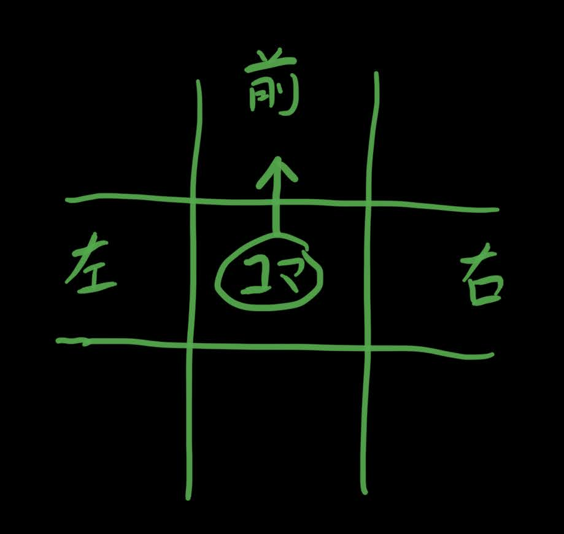

## セットアップ

-   ローカルに Node.js&npm と Docker があることを確認
-   clone したら`npm install`を実行
-   `.env`ファイルを入手してプロジェクトのルートに置く

## 実行

-   `npm run start`or`npm run debug`で動かす
    -   DB サーバのコンテナが立ち上がる(ポートは`.env`で指定)
        -   バックグラウンドで立てるので終了は手動でする必要があるかも
    -   node か tsc で API サーバが立ち上がる
        -   debug では tsc-node-dev を使っているのでコード更新すると reload してくれる
    -   localhost:3000/static にアクセスするとブラウザ上でゲームが試せる

## push 時

push 時に自動で linter がかかります。
フォーマッタのエラーが出た場合は`npm run format`を実行するか
vscode の format on save を有効にしてください。

## ルール

### 移動

TickInterval で指定された一定時間ごとにコマが移動する。

移動方向は Player が保持する Direction プロパティを使い、後述の
実際に進む方向の計算を通して実際に位置が更新される。

ユーザは次の Tick が来る前までに操作をすることで、移動したい方向を
更新することができる(try-move Event)。

### 進みたい先が移動可能かどうかの計算

以下のいずれかに該当する場合、コマはそのマスに進むことができない。

-   フィールドの範囲外である
-   現在の高さより 2 つ以上高い

### コマの実際に進む方向の計算

絶対座標から移動したい方向を前とした座標に変換して考える。

コマが移動可能な場合を 0, 不可能な場合を 1 と表すと、
以下のように決定される

-   (前, 左, 右)
-   (0, x, x) -> 前に進む
-   (1, 0, 0) -> 左右ランダムに進む
-   (1, 1, 0) -> 右に進む
-   (1, 0, 1) -> 左に進む
-   (1, 1, 1) -> 進まず次の方向を反対向きに設定する

### 落ちる判定

-   2 マス以上の高さから落ちるとプレイヤーは死ぬ
-   鬼は死なない

### 鬼の挙動

-   一番近くのプレイヤーを追いかける
-   移動性能はプレイヤーと同等

### 鬼に捕まる判定

鬼が隣のマスに来る&&そのマスとの高低差が 1 マス以下の場合
捕まったと判定されてそのプレイヤーは死ぬ

### ゲーム終了判定

-   どちらかが死んだらもう片方を winner に格納して終了
-   時間が経ったら winner なしで終了
